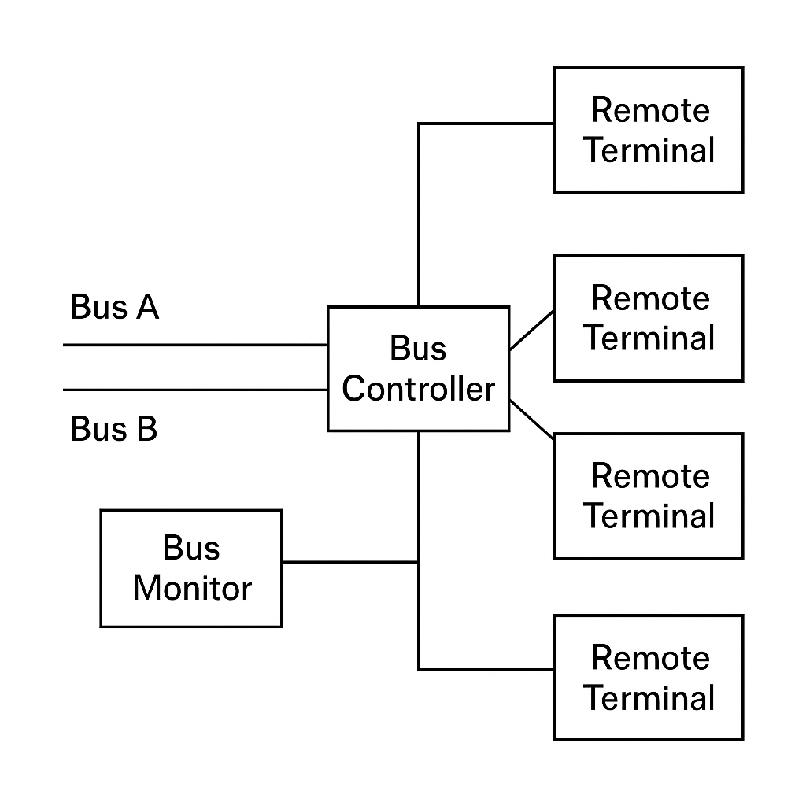

# Understanding MIL-STD-1553: The Backbone of Military Data Bus Communication

## Introduction

In modern defense and aerospace systems, reliable, deterministic communication is critical. Whether controlling weapon systems, navigation avionics, or sensor fusion, military platforms demand fault-tolerant and time-predictable data exchange. MIL-STD-1553, a digital, command/response, time-multiplexed serial bus standard, fulfills this need and has remained a mainstay since its inception in the 1970s.

## What is MIL-STD-1553?

MIL-STD-1553 (pronounced "mil standard fifteen fifty-three") is a military standard developed by the U.S. Department of Defense. It defines a method for reliable, high-integrity communication between avionics subsystems over a serial data bus. Initially intended for use in the F-16 fighter jet, its robust design has since led to its adoption in spacecraft, ships, ground vehicles, and commercial aviation.

## Key Features

- Data Rate: 1 Mbps (Manchester encoded)
- Architecture: Command/Response, Time Division Multiplexed
- Redundancy: Dual-redundant bus lines for fault tolerance
- Topology: Linear bus with passive stubs (typically with transformers)
- Maximum Devices: 31 Remote Terminals (RTs) per Bus Controller (BC)
- Message Types: RT-to-BC, BC-to-RT, RT-to-RT
- Transmission Media: Twisted Shielded Pair (TSP) cable

## Bus Architecture

A MIL-STD-1553 system consists of the following primary components:

  

- Bus Controller (BC): The master node that initiates and controls all communications.
- Remote Terminals (RT): Slave devices that receive and respond to the BC’s commands.
- Bus Monitor (BM): A passive listener for monitoring traffic.
- Dual Bus Lines: Two physically separate buses (Bus A and Bus B) provide redundancy.

## How It Works

1. Message Cycle: The BC sends a command word to an RT.
2. Data Transfer: The RT responds with status and data or receives data.
3. Timing: Each message transaction is tightly timed and acknowledged.

Messages use three types of words:
- Command Word
- Data Word
- Status Word
Each word is 20 bits: 16 data bits + 4 parity and sync bits.

## Applications

MIL-STD-1553 is widely used in:
- Fighter jets
- Helicopters
- Spacecraft
- Missile systems
- Naval vessels
- Ground vehicles

It enables interoperability between components from different vendors and withstands harsh electromagnetic and physical environments.

## Advantages

- Determinism
- High Reliability
- Long Lifespan
- Interoperability

## Limitations

- Low Bandwidth
- Fixed Architecture
- Complexity

## MIL-STD-1553 vs. Modern Protocols

MIL-STD-1553: 1 Mbps, Strong Determinism, Built-in Redundancy, High EMI Resistance, Real-Time
Ethernet: 100 Mbps+, Determinism with TSN, Configurable Redundancy, Moderate EMI, Real-Time with TSN
CAN Bus: 1 Mbps (CAN FD up to 8 Mbps), Moderate Determinism, Varies in Redundancy, Moderate EMI, Real-Time

## Conclusion

Despite being over 40 years old, MIL-STD-1553 continues to play a crucial role in mission-critical defense and aerospace systems. Its reliability, fault tolerance, and deterministic nature make it an enduring standard, especially in safety-critical domains where newer high-speed buses may not yet meet certification or robustness requirements.
